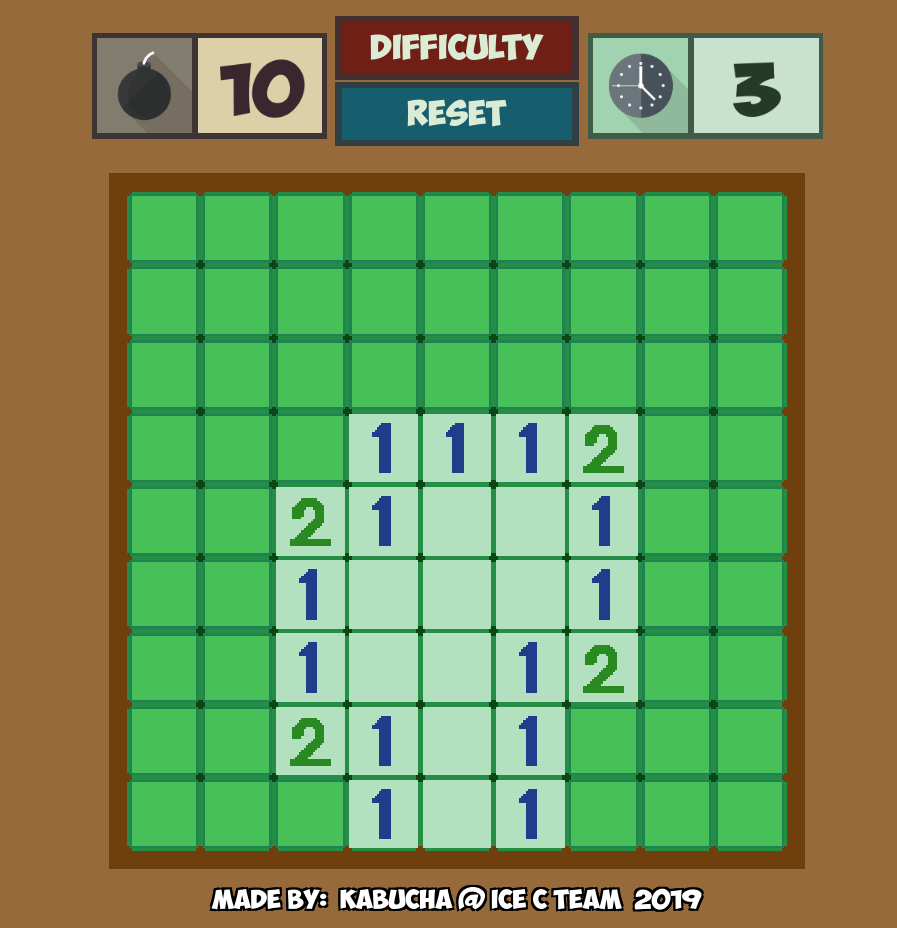

# Minesweeper
 本游戏为Windows系统自带的扫雷游戏的模仿作，仅供游戏开发的参考与学习使用。工程与源码遵循MIT协议，可以在商业软件中使用，也可进行修改，或者再次发布；使用与传播时无需任何通知，但请保留原作者信息。


## 免费素材列表：

### Font: 

Obelix Pro

[Asterix & Obelix Pro Font Family library.](https://www.dafont.com/obelixpro.font)


### SE: 

爆破・爆発01 

爆破・爆発02 

爆破・爆発04 

爆破・爆発05 

爆破・爆発14 

爆破・破砕音01 

爆破・破砕音02 

勝利！（パンパカパ～～ン）


[On-Jin ～音人～](https://on-jin.com/)


cancel1 

decision2 

decision24


[効果音ラボ](https://soundeffect-lab.info/)


### BGM: 

キミに会えた日は

[横川 佳乃助](https://dova-s.jp/bgm/play11594.html)


### Image:

 ボンバーマン風のダイナマイト素材 シンプルな時計のアイコン

[flat icon design](http://flat-icon-design.com)


## 游戏规则说明：



左键点击未被翻开的格子，就能打开这个格子。

- 如果翻开的格子下面是地雷，那么游戏结束
- 如果翻开的格子下面是数字，那么不会有其他效果
- 如果翻开的格子下面是空地，它会翻开临接的八个格子中所有不是地雷的格子

数字的含义是它周围八个格子中地雷的数目

当所有非地雷格子都被翻开之后，游戏胜利


右键可以对网格标记，被标记了的格子有点击保护，不会被直接翻开

多次点击可以在不同标记与无标记之间交替


左上角数字含义是剩余炸弹数量（炸弹总数 减去 标记了的炸弹数量，因此可能为负数）

右上角数字含义是游戏已经进行的时间


Difficulty按钮按下可以调整游戏难度，并会重开一局游戏

Reset会按照当前设定重开一局游戏，快捷键R有同样效果


## 算法讲解：

### 随机布雷：

​在一片 m * n 大小的网格之中，随机分布着 p 颗地雷 (m > 0，n > 0，m * n >= p - 9， p > 0) 。第一次点击时，点击点及周围临接的格子中地雷数为0，求分布算法


讲解：

首先，因为游戏规则设定，第一下必定会点开一块最大为 3*3​的空地，因此总格数将至少比地雷数多9，所以才有了上面的限制条件。在实际的算法之中，我使用了数组作为存储结构。数组中存储的是每一个格点的编号，最开始是按顺序排列的，在经过[Fisher–Yates shuffle](https://en.wikipedia.org/wiki/Fisher%E2%80%93Yates_shuffle)算法进行洗牌之后，最开始的 p 个元素即为被选出的埋设地雷的点。由于随机选点的时候并没有去掉安全点，所以在后面的操作时会进行判断


```C#
// 获取安全点
List<int> safePos = new List<int>(getAllValidNeighbourIndex(clickTilePos));
safePos.Add(getTileIndexByPos(clickTilePos));

// 构建格点索引数组（安全点赋值为-1）
int[] flags = new int[_XCount * _YCount];
for (int i = 0; i < flags.Length; i++){
    if (!safePos.Contains(i)){
        flags[i] = i;
    }
    else{
        flags[i] = -1;
    }
}

// 随机洗牌
for (int i = 0; i < flags.Length - 1; i++){
    int ri = Random.Range(i, flags.Length - 1);
    (flags[i], flags[ri]) = (flags[ri], flags[i]);
}

// 按顺序取格点作为放置地雷的点，遇到安全点则跳过；直到地雷放置完成
int mines = 0;
for (int i = 0; i < _XCount * _YCount; i++){
    int pos = flags[i];
    if (pos >= 0){
        setTileByIndex(pos, _MineTile);
        mines++;
    }
    if (mines >= mineNumber){
        break;
    }
}
```